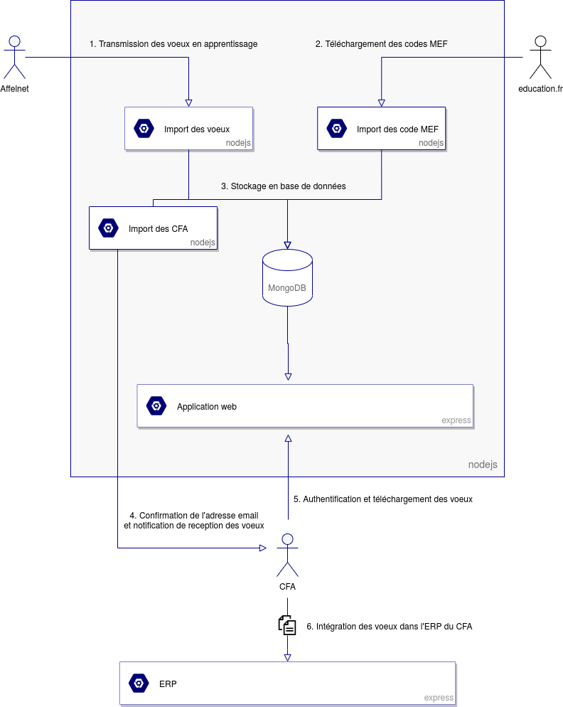

# Voeux Afflenet

Ce repository contient l'application qui permet de transmettre aux CFA les voeux formulés en apprentissage sur Affelnet.
A la réception des voeux, les CFA concernés sont notifiés par email et peuvent se connecter pour les télécharger.




## Développement


### Pré-requis

- Docker 19+
- Docker-compose 1.27+

### Démarrage

Pour lancer l'application :

```sh
make install
make start
```

Cette commande démarre les containers définis dans le fichier `docker-compose.yml` et `docker-compose.override.yml`

L'application est ensuite accessible à l'url [http://localhost](http://localhost)

Il est possible de créer un jeu de données afin de pouvoir tester l'application :

```sh
make dataset
```

Une fois cette commande executée, des emails de création de compte seront disponibles à l'url [http://localhost/smtp](http://localhost/smtp)


